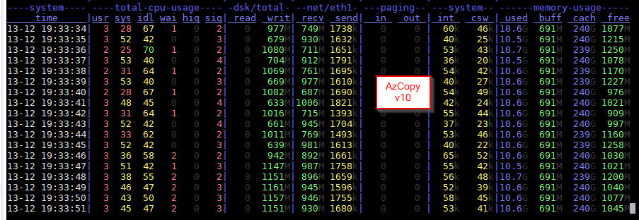
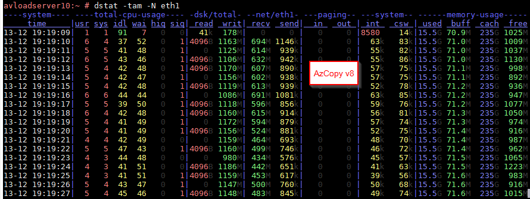

# Simple NFS Load Server
This template deploys large D64s_v3 VMs using SLES 12 SP3 into an existing VNet, attached 5x4TB premium data disks, creates a stripe set of the attached data disks, and exposes the /data directory as a NFS share.

Large D64s_v3 VM size is used so that it provides the highest premium disk throughput of up to 1200MB/s and highest network egress from the VM (both of these depend on VM size, see https://docs.microsoft.com/en-us/azure/virtual-machines/linux/sizes-general#dsv3-series-sup1sup for more details)

The script also downloads
* AzCopy v10 (preview) written in Go
* AzCopy v8 (for Linux) written in .NET Core

Using these tools, data can be download from Azure Blob Storage onto the /data stripe set of the VM. NOTE: To avoid egress charges and to have the best performance, the VMs and source storage account __must__ be in the same Azure region.

AzCopy v10 Example
```
azcopy cp --recursive --include "*" "https://yourstorageaccount.blob.core.windows.net/yourcontainer?SAS_TOKEN"  /data/azcopy_v10
```

AzCopy v8 Example
```
/root/azcopy_v3/azcopy/azcopy --recursive --source "https://yourstorageaccount.blob.core.windows.net/yourcontainer?SAS_TOKEN" --destination /data/azcopy_v8
```

dstat output while running AzCopy v10


dstat output while running AzCopy v8

